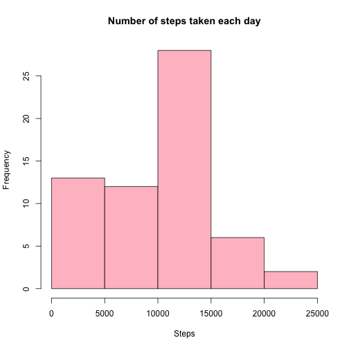
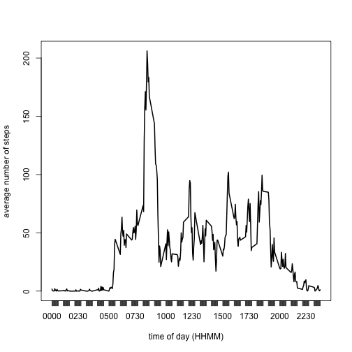
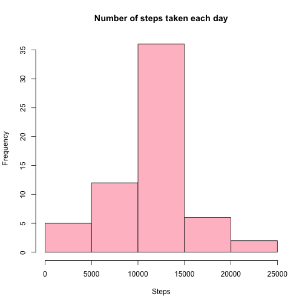
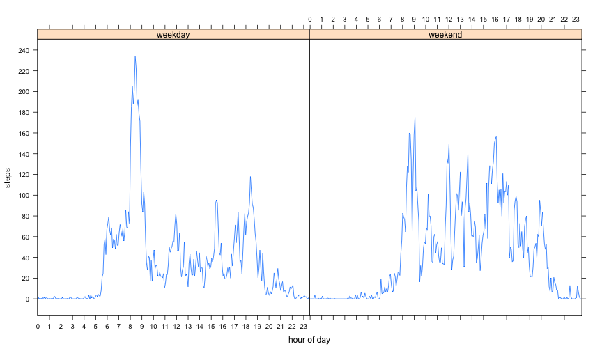

## Loading and preprocessing the data

### 1. Read the raw csv data


```r
unzip('activity.zip', exdir='data')
data <- read.csv(file.path("data", "activity.csv"), na.strings="NA")
```

### 2. Format date & time


```r
data$paddedInterval <- formatC(data$interval, width=4, format='d', flag=0)
data$datetime <-as.POSIXct(paste(data$date, data$paddedInterval), format="%Y-%m-%d %H%M")
```

## What is mean total number of steps taken per day?

### 1. Calculate the total number of steps taken per day


```r
stepsByDate <- xtabs(steps ~ date, data=data)
print(stepsByDate)
```

```
## date
## 2012-10-01 2012-10-02 2012-10-03 2012-10-04 2012-10-05 2012-10-06 
##          0        126      11352      12116      13294      15420 
## 2012-10-07 2012-10-08 2012-10-09 2012-10-10 2012-10-11 2012-10-12 
##      11015          0      12811       9900      10304      17382 
## 2012-10-13 2012-10-14 2012-10-15 2012-10-16 2012-10-17 2012-10-18 
##      12426      15098      10139      15084      13452      10056 
## 2012-10-19 2012-10-20 2012-10-21 2012-10-22 2012-10-23 2012-10-24 
##      11829      10395       8821      13460       8918       8355 
## 2012-10-25 2012-10-26 2012-10-27 2012-10-28 2012-10-29 2012-10-30 
##       2492       6778      10119      11458       5018       9819 
## 2012-10-31 2012-11-01 2012-11-02 2012-11-03 2012-11-04 2012-11-05 
##      15414          0      10600      10571          0      10439 
## 2012-11-06 2012-11-07 2012-11-08 2012-11-09 2012-11-10 2012-11-11 
##       8334      12883       3219          0          0      12608 
## 2012-11-12 2012-11-13 2012-11-14 2012-11-15 2012-11-16 2012-11-17 
##      10765       7336          0         41       5441      14339 
## 2012-11-18 2012-11-19 2012-11-20 2012-11-21 2012-11-22 2012-11-23 
##      15110       8841       4472      12787      20427      21194 
## 2012-11-24 2012-11-25 2012-11-26 2012-11-27 2012-11-28 2012-11-29 
##      14478      11834      11162      13646      10183       7047 
## 2012-11-30 
##          0
```

### 2. Make a histogram of the total number of steps taken each day


```r
hist(stepsByDate, main="Number of steps taken each day", xlab="Steps", col="pink")
```

 

### 3. Calculate mean and median of the total number of steps taken per day


```r
mean(stepsByDate)
```

```
## [1] 9354.23
```


```r
median(stepsByDate)
```

```
## 2012-10-20 
##      10395
```

## What is the average daily activity pattern?

### 1. Make a time series plot of the 5-minute interval and the average number of steps taken


```r
stepsByTime <- xtabs(steps ~ paddedInterval, aggregate(steps ~ paddedInterval, data, mean))
plot(stepsByTime, type="l", xlab="time of day (HHMM)", ylab="average number of steps")
```

 

### 2. Find the 5-minute interval, on average across all the days, with the max number of steps


```r
tail(sort(stepsByTime), 1)
```

```
##     0835 
## 206.1698
```

## Imputing missing values

Note that there are a number of days/intervals where there are missing values (coded as NA). The presence of missing days may introduce bias into some calculations or summaries of the data.

### 1. Calculate the total number of missing values


```r
nrow(data[is.na(data$steps), ])
```

```
## [1] 2304
```

### 2. Fill missing values with the mean value for the 5-minute interval, averaged across all days


```r
filledData <- data
for(i in 1:nrow(filledData)) {
  row <- filledData[i, ]
  if(is.na(row$steps)) {
    filledData[i, ]$steps <- unname(stepsByTime[row$paddedInterval])
  }
}
```

### 3. Make a histogram of the total number of steps taken each day with filled data


```r
stepsByDate <- xtabs(steps ~ date, data=filledData)
hist(stepsByDate, main="Number of steps taken each day", xlab="Steps", col="pink")
```

 

### 4. Calculate mean and median of the total number of steps taken per day


```r
mean(stepsByDate)
```

```
## [1] 10766.19
```


```r
median(stepsByDate)
```

```
## 2012-11-04 
##   10766.19
```

With missing values, mean is significantly smaller than the median value. After missing values are filled with interval means, mean and median are now the same. Both mean and median have increased compared to the unfilled dataset, as expected.
Notice that the shape of the histogram is now closer to a normal distribution.

## Are there differences in activity patterns between weekdays and weekends?

### 1. Mark weekdays and weekends in the filled dataset


```r
filledData$dayOfWeek <- sapply(weekdays(as.POSIXct(data$date)), function(day) {
  if (day %in% c('Saturday', 'Sunday'))
    factor('weekend')
  else
    factor('weekday')
})
```

### 2. Make a panel plot


```r
library(lattice)
stepsByTimeAndDayOfWeek <- xtabs(steps ~ paddedInterval + dayOfWeek,
    aggregate(steps ~ paddedInterval + dayOfWeek, data, mean))
panelData <- as.data.frame(stepsByTimeAndDayOfWeek)

x.tick.number <- 48
at <- seq(1, nrow(panelData), length.out=x.tick.number)
labels <- seq(0, x.tick.number)

xyplot(Freq ~ paddedInterval | dayOfWeek, panelData, type='l',
    xlab="hour of day", ylab="steps", pch=20,
    scales=list(y=list(tick.number=10), x=list(at=at, labels=labels)))
```

 
